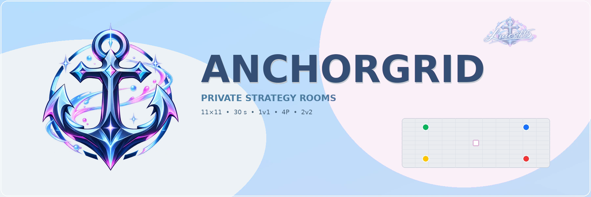

<p align="center">
  
</p>

# AnchorGrid


## v1.0.0-alpha.3 — movimiento visible + sala cercana pública

- Los indicadores de movimiento ahora usan un núcleo magenta/azul con borde blanco,
  anillo oscuro y halo cian. Permanecen legibles en Aurora, Bloom, Crystal,
  Stormlight, Nebula y Garden Pulse.
- Se inicia la arquitectura de **Juego Cercano** para iPhone/Android.
- La sala cercana es pública para dispositivos físicamente próximos:
  - no muestra código de 4 dígitos;
  - no muestra enlace de invitación;
  - espera dispositivos cercanos.
- La unidad de conexión es el **dispositivo**, pero cada dispositivo puede controlar
  uno o varios asientos.
- El host conserva siempre el botón **Iniciar partida**.
- Si faltan asientos al iniciar, AnchorGrid muestra exactamente cuáles se jugarán
  desde el dispositivo host antes de continuar.
- Esto permite configuraciones híbridas como:
  - 4P con tres dispositivos y dos jugadores en uno de ellos;
  - 2v2 con un dispositivo controlando Morado (Norte + Sur) y otro Naranja
    (Este + Oeste);
  - todos los jugadores compartiendo una sola pantalla.
- Se agrega el contrato `AnchorGridNearby` para conectar posteriormente el puente
  nativo Nearby Connections de iOS/Android sin modificar el motor del juego.

> En esta alpha, el lobby y reparto de asientos pueden probarse desde navegador.
> El descubrimiento físico real entre iPhone y Android requiere todavía enlazar
> el bridge nativo de la futura app móvil.

## v1.0.0-alpha.2 — instalación como aplicación

La bienvenida puede ofrecer **Instalar AnchorGrid** cuando el navegador admite
la instalación PWA.

- En Android/Chromium se usa el prompt nativo de instalación cuando está disponible.
- En iPhone/iPad se muestra una guía breve para **Safari → Compartir → Agregar a pantalla de inicio**.
- La instalación nunca es obligatoria para Online, Local o VS IA.
- Cuando AnchorGrid se abre desde el icono instalado, se detecta `display-mode: standalone`
  (y `navigator.standalone` en iOS), por lo que **el botón de instalar deja de aparecer**.
- El Service Worker usa el caché `anchorgrid-v1.0.0-alpha.2`.


**Versión de desarrollo: v1.0.0-alpha.2**

AnchorGrid es un juego de estrategia por turnos, mobile-first y multiplataforma, diseñado para jugar **online con amigos**, **localmente** o **contra IA**.

**Sitio:** `https://luics415.github.io/AnchorGrid/`

## Camino a 1.0

Esta alpha inicia la última gran fase antes de AnchorGrid 1.0:

- VS IA para 1v1, 4P y 2v2.
- Dificultades Fácil, Normal, Difícil y Maestro.
- IA ejecutada en Web Worker.
- Minimax + poda alpha-beta en modos de dos bandos.
- MaxN en Todos al centro (4P).
- Evaluación cooperativa real en 2v2.
- Performance Pass con rendimiento **siempre automático**.
- Optimización del drag de paredes.
- Temporizador aislado del tablero.
- Pathfinding más barato.
- Reacciones rápidas online: 😹 😸 🙀 😿 😾 😼.

## VS IA

La CPU utiliza el mismo `GameState`, las mismas reglas y las mismas acciones que un jugador. No recibe paredes extras, información oculta ni movimientos imposibles.

### Fácil

- Búsqueda superficial.
- Avanza de forma coherente.
- Considera algunas paredes.
- Escoge ocasionalmente entre varias opciones razonables.
- Deja oportunidades claras para aprender.

### Normal

- Compara rutas.
- Detecta amenazas.
- Usa paredes con intención.
- Busca un par de plies hacia adelante.

### Difícil

- Anticipa varias respuestas.
- Administra paredes.
- Castiga rutas demasiado obvias.
- Cambia entre presión y avance.

### Maestro

Maestro funciona como un pequeño motor de juego de tablero:

- iterative deepening;
- poda alpha-beta en 1v1 y 2v2;
- MaxN en 4P;
- tabla de transposición por posición;
- generación selectiva de paredes;
- presupuesto de tiempo para responder rápido;
- cuando dos líneas son prácticamente equivalentes puede escoger ocasionalmente la segunda.

Esto evita convertir Maestro en una máquina artificialmente perfecta. Si existe una jugada claramente superior, la CPU la prioriza; la pequeña variación sólo aparece entre decisiones con evaluación casi equivalente.

## IA por modo

### 1v1

Humano Norte contra CPU Sur.

La evaluación compara:

- distancia propia;
- distancia rival;
- paredes restantes;
- movilidad;
- impacto de las paredes.

### 4P

Humano Norte contra tres CPU.

La búsqueda usa **MaxN**: cada participante tiene su propia utilidad y toma decisiones desde su interés actual, en vez de tratar a las tres CPU como un solo enemigo.

### 2v2

- Norte + Sur = Equipo Morado.
- Este + Oeste = Equipo Naranja.
- El humano ocupa Norte.
- Sur es una CPU aliada.
- Este y Oeste son CPU enemigas.

La IA evalúa el estado del equipo completo. Una CPU aliada puede priorizar bloquear a Naranja si el humano Morado está cerca del centro.

## Performance Pass

El rendimiento no tiene selector manual. **Siempre funciona en AUTO.**

AnchorGrid mide los FPS reales durante la partida y utiliza histéresis para evitar cambios constantes:

- `high`
- `balanced`
- `performance`

Si detecta una caída sostenida, reduce automáticamente carga visual. Si el dispositivo se recupera durante suficiente tiempo, puede recuperar calidad.

La jugabilidad jamás cambia.

### Cambios técnicos principales

#### Temporizador

Antes, `GameScreen` actualizaba el reloj muchas veces por segundo y podía provocar renders del árbol completo del juego.

Ahora `TurnTimer` es independiente y actualiza únicamente su panel.

#### Arrastre de paredes

Antes era posible evaluar hasta 100 anclajes de pared durante un render de drag.

Ahora:

```text
pointermove
   ↓
requestAnimationFrame
   ↓
anclaje debajo del puntero
   ↓
1 validación BFS
```

Los otros 99 slots son sólo hitboxes baratos.

#### Pathfinding

El BFS ya no consulta todas las paredes para cada arista explorada.

Cada búsqueda construye primero un conjunto de aristas bloqueadas y después usa lookups O(1). Además se eliminó `Array.shift()` del hot path del BFS.

#### Atmósferas

`ThemeAtmosphere` recibe el nivel automático de rendimiento y ajusta la cantidad real de elementos:

- High: escena completa.
- Balanced: menor densidad.
- Performance: densidad reducida y menos capas caras.

No existe un botón para que el usuario deje accidentalmente la calidad demasiado alta.

## Reacciones rápidas

Durante partidas online aparece el botón de reacciones:

```text
😹  😸  🙀
😿  😾  😼
```

Las reacciones:

- duran pocos segundos;
- muestran quién reaccionó;
- tienen rate limit local;
- viven en `/rooms/<code>/reactions`;
- se limpian de forma oportunista;
- **no escriben en `/game`**.

Esto es importante: mandar un emoji nunca entra en la transacción de una jugada y no puede competir con mover una ficha o colocar una pared.

## Modos

El tablero continúa siendo siempre **11×11**.

- **Duelo 1v1:** Norte vs Sur.
- **Todos al centro (4P):** cuatro jugadores hacia `(5,5)`.
- **Equipos 2v2:** Morado vs Naranja.

Todos comienzan con **10 paredes por jugador**.

## Reglas principales

- Una acción por turno: mover o colocar pared.
- Movimiento ortogonal.
- Saltos automáticos.
- Salto diagonal cuando el salto recto queda bloqueado.
- Paredes de dos segmentos.
- Sin cruces ni solapamientos.
- BFS obligatorio después de colocar paredes.
- Ningún jugador activo puede quedar sin ruta.
- La meta central no puede sellarse por completo.
- 30 segundos por turno.
- Aviso de inactividad + gracia antes de saltar turno.

## Atmósferas

Se mantienen:

- Aurora.
- Bloom.
- Crystal.
- Stormlight.
- Nebula.
- Garden Pulse.

La paleta base continúa:

```text
#344D75  #4A7CA1  #637D98  #B6DDFE  #BAF0FA  #F7C5EB  #D069B8
```

## Stack

- Vite
- React 19
- TypeScript
- Zustand
- Firebase Anonymous Auth
- Firebase Realtime Database
- Web Workers
- Vitest
- GitHub Pages + GitHub Actions

## Desarrollo local

```bash
npm install
npm run dev
```

Para probar desde otros dispositivos:

```bash
npm run dev -- --host
```

## Validación

```bash
npm test
npm run build
```

## Publicación de esta alpha

```bash
git add -A
git commit -m "feat: AnchorGrid 1.0 alpha AI and automatic performance pass"
git push
```

El Service Worker utiliza:

```text
anchorgrid-v1.0.0-alpha.2
```

Si GitHub Pages muestra una versión antigua después del deploy, realiza una recarga forzada o abre una vez el sitio en una pestaña privada.

<p align="center">
  
</p>
